# [fit] App Transport Security:
# [fit] What, Why, How?

---

^ Who am I?

# About Me

- Chris Dzombak
- iOS @ NY Times
- @cdzombak on Twitter

---

## Don’t take notes.

^ We’re going to cover a lot of ground in this talk, but don’t worry about taking notes.

^ I’ll post these slides and notes online later, and I’ll share them on the Meetup and Facebook events.

---

# App Transport Security

- WWDC 2015
- iOS 9
- OS X 10.11

^ App Transport Security was introduced at WWDC 2015 and released with iOS 9 and OS X 10.11.

---

# App Transport Security

…is just a few rules about network connections.

^ So what _is_ ATS?

^ Actually very straightforward. It’s a few security rules that your app’s network requests must follow.

---

# App Transport Security

…is just a few rules about network connections.

…for apps built against the iOS 9 or OS X 10.11 SDKs.

^ These rules apply to your app if it’s built against the newest iOS or OS X SDKs.

^ Aside: this does mean that existing apps built against older SDKs see no change when running on the latest versions of iOS and OS X.

---

# The rules

^ I’ll go over each of these rules, one at a time, and try to explain what it means and why it’s important.

---

## No HTTP

^ Apps cannot use plain old HTTP: only HTTPS.

^ This is important for security, for obvious reasons.

^ These next few rules assume you’re familiar with the basic concepts behind HTTPS, like the TLS protocol that we use to provide security, and what SSL certificates are. But even if you’re not familiar, I’ll give an overview as to why each rule is important.

---

## TLS 1.2

^ TLS is the protocol that adds security to HTTP — it’s the “S” part of HTTPS.

^ TLS 1.2 must be used. TLS 1.2 is the latest version of the SSL/TLS protocols which can be used for HTTPS connections.

^ This is important because some of the best cryptographic algorithms, which we’ll cover on the next slide, are only available in TLS 1.2.

^ And because various attacks exist for older versions of SSL and TLS; some more theoretical than others.

^ https://en.wikipedia.org/wiki/Transport_Layer_Security#Attacks_against_TLS.2FSSL

---

## Good TLS cipher suite, that provides forward secrecy

^ A “cipher suite” is a specific combination of cryptographic algorithms that will be used to set up a TLS connection.

^ There are a lot of possible combinations of cryptographic algorithms that TLS can use, and some are more secure & provide different security guarantees than others.

^ ATS says, the cipher suite chosen for a connection must provide “forward secrecy”, and it must be one of several cipher suites we currently think provides the best possible security.

^ “Forward secrecy” means that even if the server’s private key is compromised, past HTTPS sessions—which might have been recorded by someone like the NSA and saved for later—remain secure.

^ For more information: https://scotthelme.co.uk/perfect-forward-secrecy/

^ This is important because it restricts you to using cryptographic algorithms we believe are solid, and it protects your users if your server’s private key is ever stolen.

^ Apple’s documentation provides a list of acceptable cipher suites: https://developer.apple.com/library/ios/documentation/General/Reference/InfoPlistKeyReference/Articles/CocoaKeys.html#//apple_ref/doc/uid/TP40009251-SW35

^ https://en.wikipedia.org/wiki/Cipher_suite

---

## SSL certificate issued by a trusted certificate authority

^ The server’s SSL certificate must have been issued by a trusted certificate authority.

^ Now, the exact phrasing of Apple’s published guidelines on this isn’t 100% clear to me.

^ The gist is, no self-signed SSL certificates, and installing a root certificate authority designed to enable debugging with a tool like Charles won’t work.

^ This is important because we’ve seen many examples of governments and companies, in the wild, using counterfeit certificates to intercept HTTPS traffic on their networks. This App Transport Security rule shuts down that avenue of attack.

^ https://www.charlesproxy.com/documentation/faqs/ssl-proxying-with-ios-9/

---

## Safe lengths for encryption keys

- RSA keys: 2048 bits or longer
- ECC keys: 256 bits or longer

^ The server’s certificate must use an encryption key that meets these size requirements.

^ This is important simply because we think that even nation-state level attackers can’t currently break encryption keys of this size.

^ When whoever runs your servers generates a certificate signing request, they’ll need to be sure to generate a key that meets these requirements.

---

## Server certificate uses SHA-256 or better

^ Finally, your server’s certificate has to use SHA-256 or a better hashing algorithm. Specifically, the server’s certificate must not use MD5 or SHA-1.

^ This hashing algorithm is what your browser uses to verify that a server’s certificate is valid.

^ This is important because if the certificate is using a weak hash algorithm, an attacker could forge a fake SSL certificate, with the same digital signature. That would let them intercept your users’ traffic.

---

# ATS Rules

- HTTPS
- TLS 1.2
- TLS cipher suite with forward secrecy
- Trusted certificate authority
- Safe encryption key size
- Certificate using SHA-256 or better

^ Those are the rules. They’re mostly things that the people who run your servers need to worry about.

^ Later in the talk, we’ll cover some debugging tools you can use to figure out if a server complies with the rules, and how you can make your app talk to a server that doesn’t comply.

^ None of these rules are particularly crazy. They’re trying to enforce security best practices which you should be following already.

^ And each of these rules has a specific and important security benefit for your users.

---

## HTTPS Best Practices

^ App Transport Security just enforces using HTTPS, with best practices, for your app’s networking.

^ How does this fit into other application security strategies?

---

## Certificate pinning?

^ Certificate Pinning is a different security feature, which App Transport Security can work in concert with. But they don’t affect each other.

^ With certificate pinning, you include your server’s certificate in your application bundle. Then, when you make an HTTPS connection, you verify that the server sent you that exact same certificate.

^ This helps eliminate cases where an attacker on the network, between your server and your user, generates a certificate which appears valid for your site. Some enterprise Internet gateway devices — and some governments — do things like this.

^ Google uses this strategy with Chrome to ensure that Chrome users are safe from rogue certificates for most Google sites.

^ Further reading: https://www.owasp.org/index.php/Certificate_and_Public_Key_Pinning

---

# Almost nobody uses certificate pinning 😢

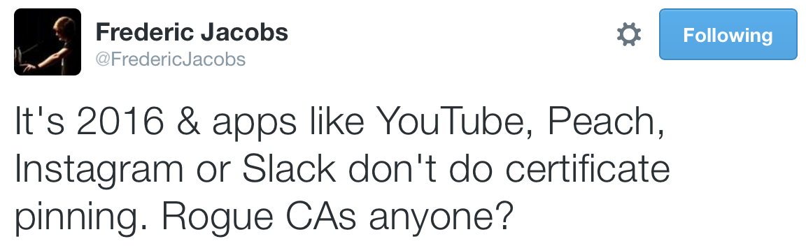

^ Unfortunately, almost nobody uses certificate pinning.

^ But at least the App Transport Security rule about trusted certificate authorities helps alleviate this threat.

---

# ATS is implemented somewhere in Core Foundation territory

App Transport Security rules apply to `NSURLSession`, `NSURLConnection`, `libcurl`, …

^ These rules are implemented at a low level in the networking stack — somewhere in Core Foundation Networking.

^ So ATS enforces its rules on `NSURLSession` and the older `NSURLConnection` APIs, and on lower-level code which uses Core Foundation networking directly.

---

## ATS: On the server

^ Okay, so now you know what App Transport Security is, and why the rules it enforces are important.

^ I know most of you are client-side developers, but I want to review a couple recommendations which will help you implement them on a server. If you’re having App Transport Security problems, you can share these recommendations with your infrastructure or devops people.

---

# ATS: On the server

- Use Mozilla’s server-side TLS guide and configuration generator
- Get a free certificate from Let’s Encrypt
- Or an inexpensive one from Namecheap
- Test with SSLLabs SSL Tester

^ To put together a good server configuration which uses current best practices, refer to Mozilla’s Server-Side TLS guide: https://wiki.mozilla.org/Security/Server_Side_TLS

^ And their automatic configuration generator: https://mozilla.github.io/server-side-tls/ssl-config-generator/

^ Seriously, just use this. Don’t worry about it, unless you’re really curious.

^ To get a SSL certificate, use Let’s Encrypt: https://letsencrypt.org

^ Let’s Encrypt just recently launched in public beta, and it’ll give you a free certificate for your site, that’s supported in all major browsers.

^ If you don’t want to use Let’s Encrypt for some reason, Namecheap will sell you cheap certificates ($9-10 per year): https://www.namecheap.com/security/ssl-certificates.aspx

^ Finally, to test your server’s configuration and make sure you’re using best practices…

^ Test your server’s TLS configuration with SSLLabs’ SSL Tester: https://www.ssllabs.com/ssltest/

^ On your own machine, try testssl.sh: https://testssl.sh

^ That’s how you can make a server implement these best practices.

---

## Adopting ATS

^ Let’s move on now to review how you can adopt App Transport Security in your apps — and how to properly configure exceptions to work around problems that can come up.

---

## Build against the iOS 9/OS X 10.11 SDK

^ App Transport Security is enabled automatically when you build against new Apple SDKs.

---

# ATS Exceptions

- Configure exceptions per-domain
- `NSAppTransportSecurity` key in `Info.plist`

^ Of course, you’re likely to run across servers which haven’t been upgraded to support best practices yet. And your app might need to talk to noncompliant third party servers, which your company doesn’t control.

^ Most App Transport Security policies can be opted out of on a per-domain basis, rather than requiring you to turn off ATS entirely.

---

```
NSAppTransportSecurity : Dictionary {
    NSExceptionDomains : Dictionary {
        <domain-name-string> : Dictionary {
            NSIncludesSubdomains : Boolean
            NSExceptionAllowsInsecureHTTPLoads : Boolean
            NSExceptionRequiresForwardSecrecy : Boolean
            NSExceptionMinimumTLSVersion : String
        }
    }
    NSAllowsArbitraryLoads : Boolean
}
```

^ Here’s the general structure of the App Transport Security dictionary in your `Info.plist`.

^ The keys and possible values are all documented, in Apple’s Cocoa documentation about `Info.plist`: https://developer.apple.com/library/ios/documentation/General/Reference/InfoPlistKeyReference/Articles/CocoaKeys.html#//apple_ref/doc/uid/TP40009251-SW33

^ The gist is, we can include an exception domain name, and under that domain name we can tell App Transport Security what exceptions apply for that domain.

^ Let’s dig into the `NSExceptionDomains` key.

---

# `NSExceptionDomains`

- Optional.
- Dictionary. Keys are domain names; values are dictionaries.

^ The `NSExceptionDomains` key goes into the App Transport Security dictionary in your `Info.plist`.

^ This is a dictionary, whose keys are domains you want to configure App Transport Security exceptions for.

^ These have to be lowercase domain names, not numeric IPs, and no port numbers.

^ Within an exception domain dictionary, we can place any of several keys…

---

# `NSIncludesSubdomains`

- Optional; defaults to `NO`.
- Whether this domain’s exceptions apply to its subdomains, too.

---

# `NSExceptionMinimumTLSVersion`

- Optional; defaults to `TLSv1.2`.
- The minimum TLS version that will be accepted for connections to this domain.
- Valid values: `TLSv1.0`, `TLSv1.1`, `TLSv1.2`

---

# `NSExceptionRequiresForwardSecrecy`

- Optional; defaults to `YES`.
- Setting to `NO` allows for using TLS cipher suites that don’t provide forward secrecy for connections to this domain.

^ Setting this to `NO` allows a few more TLS cipher suites to be used, which don’t provide the forward secrecy properties we talked about earlier.

^ This means that if someone records network traffic to this domain and later steals the server’s private key, the attacker will be able to use that key to decrypt the historical browsing sessions.

^ In principle, your servers should support forward secrecy and you should hopefully never have to turn this requirement off.

---

# `NSExceptionAllowsInsecureHTTPLoads`

- Optional; defaults to `NO`.
- If `YES`, your app can connect insecurely to this domain with no certificate, or a self-signed, expired, or hostname-mismatched certificate.

^ In some cases you still need to use other exception-dictionary keys along with this one to establish a connection.

^ For example, to connect to an HTTPS server that uses a self-signed certificate *and* an old TLS version, set this value to YES and also set an appropriate value for the `NSExceptionMinimumTLSVersion` key.

^ And to accept a hostname-mismatched, self-signed, or expired certificate, you still need to hook into the relevant trust evaluation APIs in `NSURLSession` or `NSURLConnection`. This key alone doesn’t override the standard certificate trust checks that the networking stack provides.

---

# Third-party exceptions

- `NSThirdPartyExceptionAllowsInsecureHTTPLoads`
- `NSThirdPartyExceptionRequiresForwardSecrecy`
- `NSThirdPartyExceptionMinimumTLSVersion`

^ Those previous 3 exception keys are supposed to be used for domains you control. There are analogous keys to be used to configure exceptions for domains your company does not control.

^ It is unclear exactly why there are distinct “third party” versions of these exceptions, but I have a theory. We’ll get to that later in the talk.

---

```
NSAppTransportSecurity : Dictionary {
    NSExceptionDomains : Dictionary {
        <domain-name-string> : Dictionary {
            NSIncludesSubdomains : Boolean
            NSExceptionAllowsInsecureHTTPLoads : Boolean
            NSExceptionRequiresForwardSecrecy : Boolean
            NSExceptionMinimumTLSVersion : String
        }
    }
    
    // let’s talk about this…
    NSAllowsArbitraryLoads : Boolean
}
```

^ If we go back to this structure in `Info.plist`, there’s one more key, directly under the App Transport Security dictionary, that we have to examine.

---

# `NSAllowsArbitraryLoads`

- Optional; defaults to `NO`.
- When `YES`, disables ATS for all domains, except those you configure via exceptions.

^ So, just setting this to YES is the nuclear option, which you shouldn’t use.

^ But you can disable ATS across the board, then use exception domains to reenable it for your own domains. We’ll cover this in a later example.

---

# Exceptions can opt domains out of ATS…
…
# …or, if ATS is disabled via `NSAllowsArbitraryLoads`, exceptions can opt domains back _into_ ATS.

^ So here’s a key point: you can either leave App Transport Security enabled and use exceptions to opt specific domains out of ATS, **or** you can disable App Transport Security generally and opt specific domains back _in_ to ATS.

^ This turns out to be really useful, and I’ll go over some examples of this later.

^ And with this note … it’s time for configuration examples!

^ Rather than going over every possible example, I’m going to show a few patterns which you can expand on to configure ATS for your own apps.

---

# Domain only accessible via HTTP

^ Let’s say you have a server you need to connect with via plain old HTTP.

```
NSAppTransportSecurity
   NSExceptionDomains
     "media-server.example.com"
       NSExceptionAllowsInsecureHTTPLoads = YES
```

---

# Domain running an old TLS configuration

^ Let’s say you have an old server that hasn’t been updated to support TLS 1.2 and forward secrecy.

```
NSAppTransportSecurity
   NSExceptionDomains
      "less-secure.example.com"
         NSExceptionRequiresForwardSecrecy = NO
         NSExceptionMinimumTLSVersion = "TLSv1.0"
```

---

# Connecting to user-provided URLs, but using ATS for your own domain

^ Now, for this next example, let’s flip around how we’re using exceptions.

^ Let’s say your app includes a web browser, so you have to allow browsing to any site. But you still want communications with your site to use App Transport Security.

```
NSAppTransportSecurity
   NSAllowsArbitraryLoads = YES
   NSExceptionDomains
      "api.example.com"
         NSExceptionAllowsInsecureHTTPLoads = NO
         NSExceptionRequiresForwardSecrecy = YES
         NSExceptionMinimumTLSVersion = "TLSv1.2"
```

---

## `SFSafariViewController` == no ATS configuration needed

^ I’ll note that if your in-app web browser uses `SFSafariViewController`, new in iOS 9, you don’t have to opt your app out of App Transport Security.

^ Safari View Controller runs in a separate process and therefore your app’s ATS policy isn’t applied to it.

---

# NSA-friendly mode

^ You can disable App Transport Security entirely by doing just this. I call this “NSA-friendly mode,” and sadly it’s what many developers are doing.

```
NSAppTransportSecurity
   NSAllowsArbitraryLoads = YES
```

---

## Best practice: make the narrowest exceptions you can

^ As a guiding principle, try to configure the narrowest exceptions that you can. This helps keep your users’ information secure.

^ This means, for example, you should use the debugging tools we’re going to cover later to figure out a proper ATS configuration for your app, instead of turning ATS off entirely.

---

# Connecting to IP addresses over standard HTTP

^ There are a few App Transport Security requirements you can’t configure via exceptions, so I’ll review them here.

^ What if your app needs to connect to IP addresses over standard HTTP? This is something that ForeFlight, the app for pilots, needs to do to connect to networked devices in the cockpit.

^ You can’t leave ATS on and configure an exception for “IP addresses”. Instead, turn ATS off and then opt your domains back into it.

```
NSAppTransportSecurity
   NSAllowsArbitraryLoads = YES
   NSExceptionDomains
      "api.example.com"
         NSExceptionAllowsInsecureHTTPLoads = NO
         NSExceptionRequiresForwardSecrecy = YES
         NSExceptionMinimumTLSVersion = "TLSv1.2"
```

---

# Connecting to domains with SHA-1 certificates or small key sizes

^ What if you need to connect to a server using a certificate signed with SHA-1, or a shorter encryption key length than App Transport Security allows?

^ There aren’t exceptions to opt out of these specific requirements. Instead you’ll need to allow insecure loads for the domain.

```
NSAppTransportSecurity
   NSExceptionDomains
      "i-need-a-new-certificate.example.com"
         NSExceptionAllowsInsecureHTTPLoads = YES
```

---

## Debugging

^ How do you debug App Transport Security issues?

---

# `-98xx`

^ Most App Transport Security errors returned to your app will show up as Core Foundation errors in the `-9800` range.

^ But these errors generally don’t mention App Transport Security directly. So let’s review a few debugging tactics.

---

## Disable ATS
## (temporarily)

^ Try temporarily disabling App Transport Security entirely.

---

# Disable ATS (temporarily)…
…
# …then narrow down the issue with exception domains

^ If disabling ATS fixes the network issue, try using exception domains to narrow down the source of the problem.

---

#[fit] `CFNETWORK_DIAGNOSTICS=1`

CFNetwork Diagnostic Logging (Technical Q&A 1887)

https://developer.apple.com/library/ios/qa/qa1887/_index.html

^ Try setting the environment variable `CFNETWORK_DIAGNOSTICS` to `1`. This will cause the Core Foundation Network layer to log detailed debugging information to a file. The path to that log will show up in your app’s console.

^ This log will reveal useful debugging information, including underlying errors that led to whatever failure you’re seeing.

---

#[fit] `nscurl --ats-diagnostics`

^ This tool is available on OS X 10.11.

^ It tries connecting to the given host with various combinations of App Transport Security exceptions and reports the results.

---

## `nscurl --ats-diagnostics --verbose https://www.dzombak.com`

^ The `verbose` flag will report detailed errors, along with the exact App Transport Security dictionary used for each connection.

---

# `nscurl --ats-diagnostics`

^ This tool is useful for quickly figuring out…

- Can I connect to this server with ATS?
- Why not?
- What exceptions do I need to configure?

---

##[fit] Working with Charles Proxy:
## (temporarily) disable ATS

^ It’s worth noting the impact App Transport Security has on debugging with Charles, the network debugging proxy.

^ To debug HTTPS connections in your own apps, you’ll have to disable App Transport Security.

^ You can’t use Charles to intercept traffic for other apps that use ATS, since you’d need a valid certificate for those other domains.

^ https://www.charlesproxy.com/documentation/faqs/ssl-proxying-with-ios-9/

---

# Additional ATS reference/debugging resources

**Remember, these slides will be posted online shortly.**

https://gist.github.com/cdzombak/3d2ff091b9038fde27bb

^ https://developer.apple.com/library/ios/documentation/General/Reference/InfoPlistKeyReference/Articles/CocoaKeys.html#//apple_ref/doc/uid/TP40009251-SW33
^ http://timekl.com/blog/2015/08/21/shipping-an-app-with-app-transport-security/
^ http://useyourloaf.com/blog/app-transport-security.html
^ http://www.neglectedpotential.com/2015/06/working-with-apples-application-transport-security/
^ https://developer.apple.com/library/ios/qa/qa1887/_index.html

---

## Who’s actually using ATS?

^ Back in September 2015, I did a brief survey of a few popular apps for a blog post. The results weren’t pretty.

^ These results and my commentary are on my blog: https://www.dzombak.com/blog/2015/09/Nobody-is-using-App-Transport-Security--what-s-next-.html

---

# September 2015

- 1Password (6.0): ❌ opts out
- Dropbox (4.0): ❌ opts out
- Facebook (39.1): ❌ opts out
- Google Maps (4.10.1): ❌ opts out
- …

---

# September 2015

- …
- Instagram (7.6.0): ❔
- Microsoft OneNote (2.16.1): ❌ opts out
- Tumblr (4.5): ✅ uses ATS properly

^ Instagram at the time had a complex configuration that allows insecure loads, but it’s slightly better than nothing.

^ This week, I surveyed those apps again plus several other popular apps.

---

# Jan. 2016: 1Password (6.2) ✅

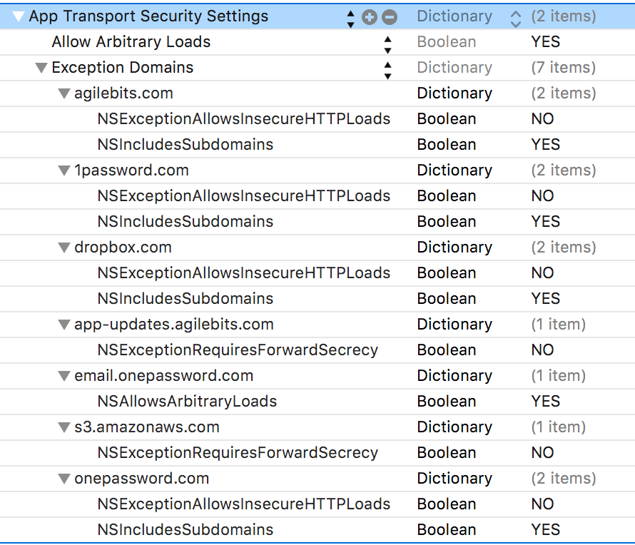

^ Gets a passing grade. But, in the exception domains where they reenable App Transport Security for specific domains, Apple’s documentation recommends that they should also set the minimum TLS version and enforce forward secrecy.

^ And it’s unclear why they have an exception opting Amazon S3 out of forward secrecy, when arbitrary loads are already allowed.

---

# January 2016

- Dropbox (4.2.2): ❌ opts out
- Facebook (46.0): ❌ opts out
- Facebook Messenger (53.0): ❌ opts out
- Flickr (4.0.7): ✅
- Gmail (4.3): ❌ old SDK

^ The latest version of the Gmail app was built against the iOS 8.4 SDK, so App Transport Security isn’t enabled for it.

---

# Jan. 2016: Evernote (7.9.2) ❌

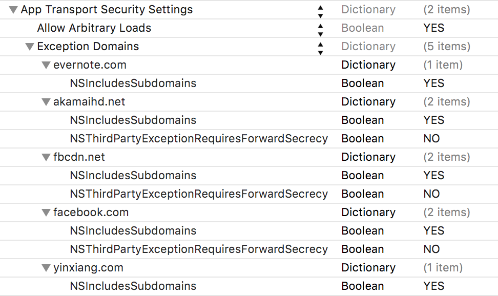

^ Evernote has tried to configure exceptions properly, but they’ve failed to actually turn off `NSExceptionAllowsInsecureHTTPLoads`, which would reenable the ATS rules for their exception domains.

---

# Jan. 2016: ForeFlight (7.5.1) ✅

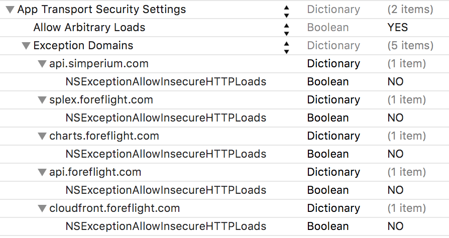

^ ForeFlight gets a passing grade. But, in the exception domains where they reenable App Transport Security for specific domains, Apple’s documentation recommends that they should also set the minimum TLS version and enforce forward secrecy.

---

# January 2016

- Google (11.1.0): ❌ opts out
- Google Maps (4.14.0): ❌ opts out
- Microsoft OneNote (2.18.1): ❌ opts out
- Pages (2.6.1): ✅
- Peach (1.0.9): ❌ opts out

---

# Jan. 2016: Instagram (7.13.1) ❔

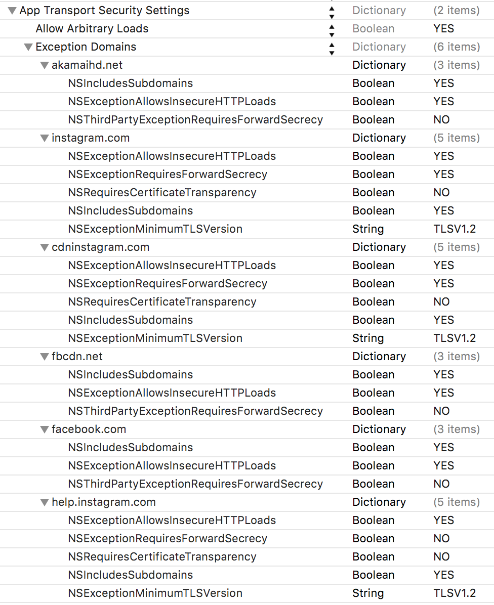

^ Instagram still has a complex App Transport Security configuration. It looks to me like they’re allowing insecure loads for their own domains to allow compatibility with an outdated certificate or server configuration, which is problematic for user security.

---

# Jan. 2016: Pinterest (5.7.2) ❔

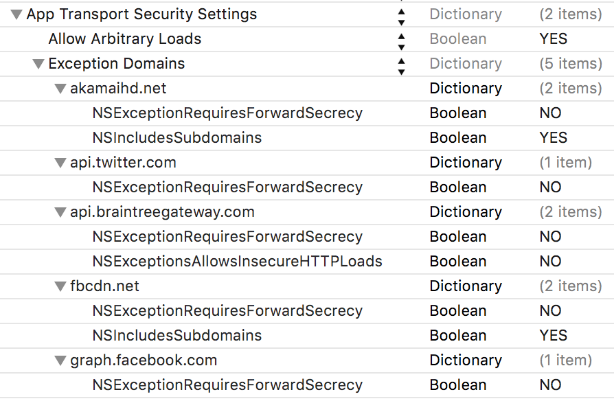

^ Pinterest has tried to configure exceptions, but they’ve failed to actually turn off `NSExceptionAllowsInsecureHTTPLoads`, which would reenable the ATS rules for their exception domains.

^ Except for the Braintree API, which does payments processing. This one small, correct choice is the only reason I’m not failing them.

---

# Jan. 2016: Tumblr (5.1): ❌

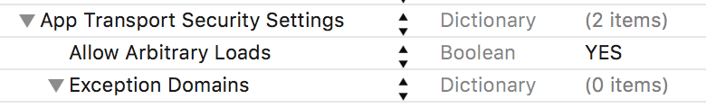

^ This was surprising, since back in September Tumblr was using App Transport Security properly.

^ Now, they’ve just disabled it across the board, with no exceptions.

---
 
# Yahoo Weather (1.9.0) ❌

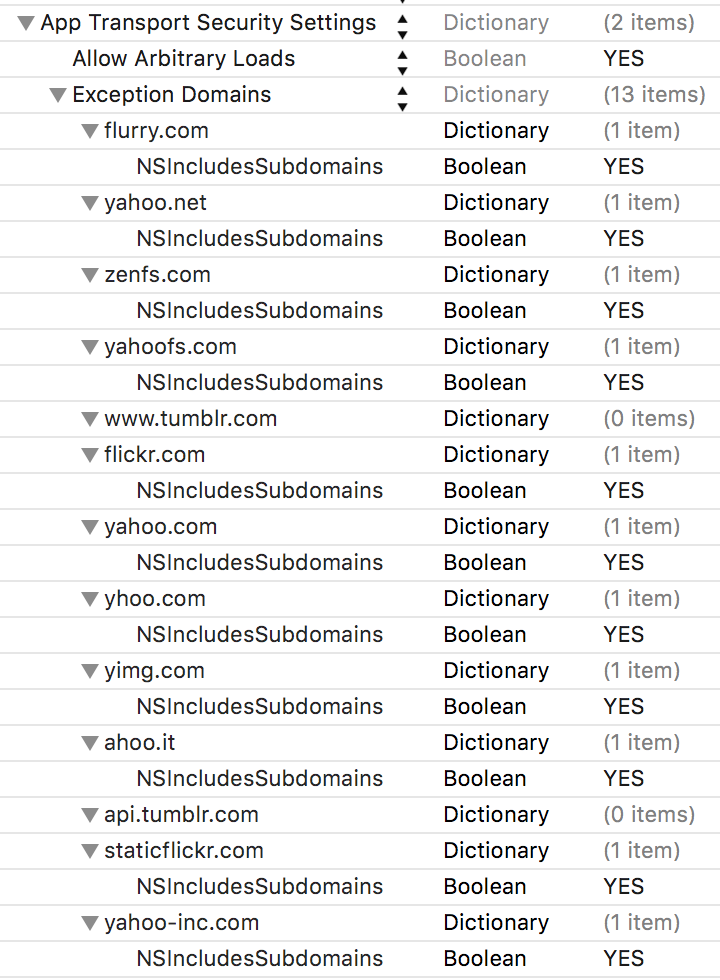

^ Yahoo has tried to configure exceptions, but they’ve failed to actually turn off `NSExceptionAllowsInsecureHTTPLoads`, which would reenable the ATS rules for their exception domains.

---

# January 2016

- Slack (2.66): ❌ opts out
- Snapchat (9.21.1): ✅
- YouTube (10.50.18): ❌ opts out

^ Snapchat has allowed arbitrary loads in general, and I don’t see why that’s necessary. But at least they’ve properly configured exceptions to enforce ATS on important domains.

---

## 5 of those 20 apps use ATS reasonably well.

^ This brings me to the question: why do so many major apps just turn App Transport Security off entirely?

---

## It’s hard?
## (debugging is hard?)

---

## Ad networks

^ I’ve written before about how terrible ad networks are; they still serve a lot of content over plain old HTTP. Most advertising libraries for iOS require disabling App Transport Security.

^ https://www.dzombak.com/blog/2015/09/Ad-blockers-aren-t-killing-the-web--ad-networks-are-killing-the-web.html

^ https://www.dzombak.com/blog/2016/01/Ad-light--malware-heavy.html

---

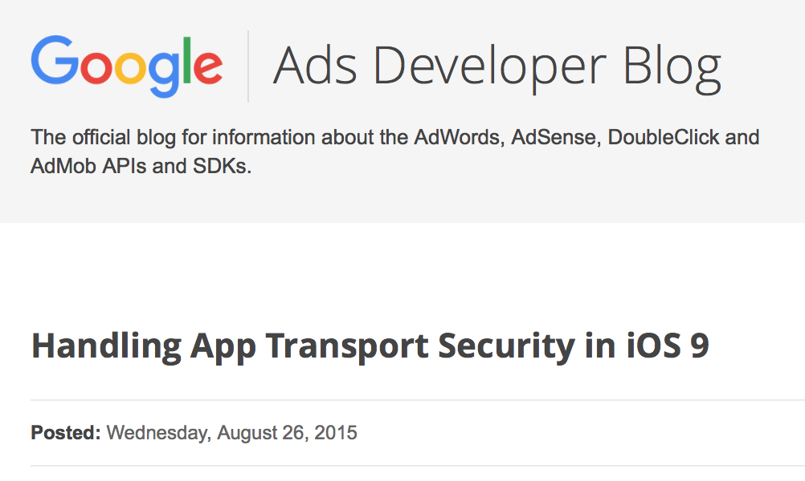

^ In fact, Google’s Ads Developer Blog recommended disabling App Transport Security entirely to ensure ads keep working.

---

“To ensure ads continue to serve on iOS9 devices for developers transitioning to HTTPS, the recommended short term fix is to add an exception that allows HTTP requests to succeed and non-secure content to load successfully.

Publishers can add an exception to their Info.plist to allow any insecure connection…”

---

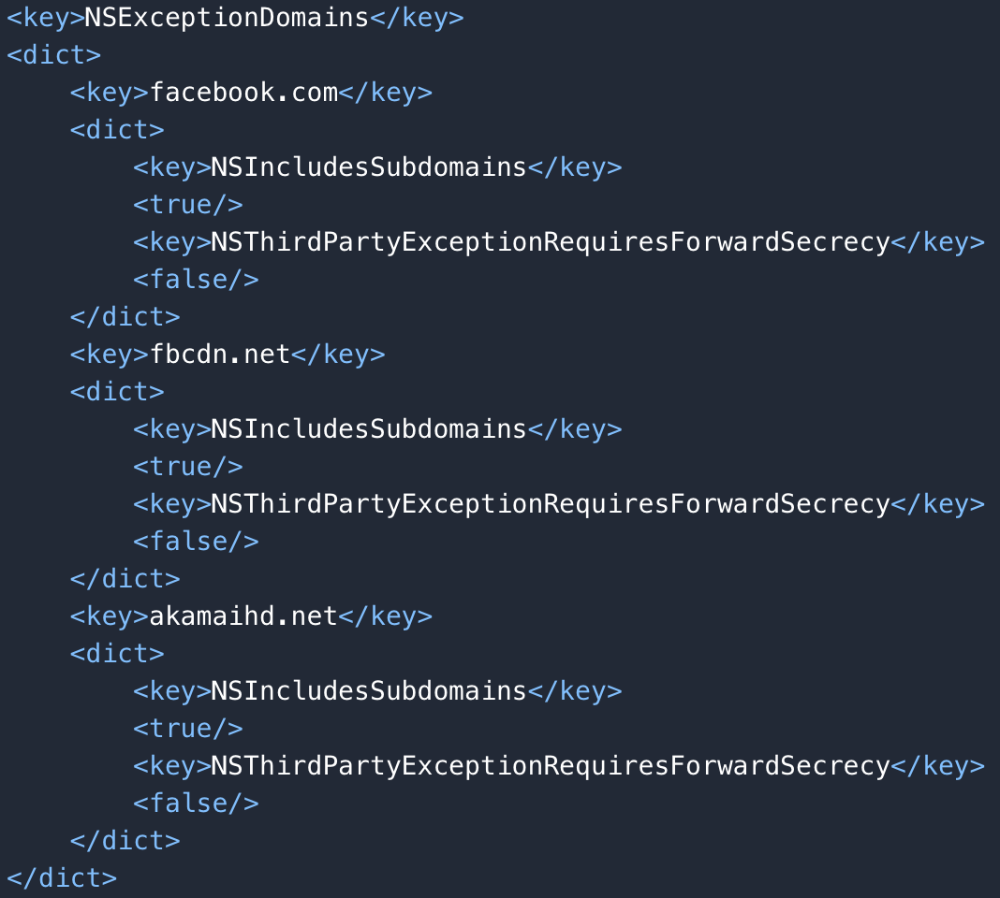

^ And Facebook recommends disabling App Transport Security for their domains, plus the Akamai content distribution network, if you use the Facebook SDK in your app.

---

# Lack of awareness/unwillingness to learn?

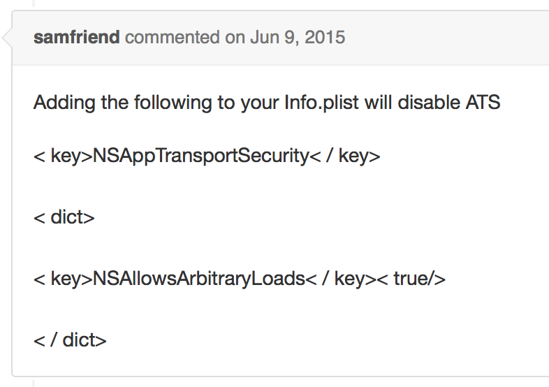

^ It’s definitely easier to just disable App Transport Security than learn about it, and that’s what a lot of people are doing.

---

# Lack of caring?


^ A lot of apps are shipped with a very “minimum viable product” mentality: “make it work and ship it”.

---

## Lack of clear documentation from Apple?

^ There’s no denying that Apple has given us relatively little documentation about App Transport Security. A little help on their part would go a long way.

---

## What’s next?

^ There are a lot of reasons that App Transport Security isn’t widely deployed. But, finally, what’s next?

---

# 🍎

^ Apple tends to telegraph their plans by suggesting that developers should adopt something which is going to become increasingly important over the next few years.

^ As examples, consider Auto Layout and Size Classes.

---


^ I suspect that within the next two years — and therefore within the next two major versions of iOS and OS X — Apple will start rejecting apps that simply opt-out of App Transport Security with no good reason, during the App Review process.

^ I suspect this is why we have “third party exception” keys for opting-out certain domains in `Info.plist`: during the review process, it could indicate to Apple “this isn’t my domain and I have no control over it.”

^ I have no sourcing to support this, but it’s in line with Apple’s public commitment to security and privacy.

^ And as an iOS user who cares about my own security, I will welcome this change.

---

## Start now.

^ So it’s in your best interest to get things moving on App Transport Security compliance now rather than later.

^ And again, these are best practices to follow if you care about your users, regardless of whether Apple incorporates App Transport Security into the App Review process.

---

# Conclusions (1/2)

- ATS enforces current security best practices
- Don’t disable it
- Configure your servers to support the TLS configuration ATS requires
- Configure the most narrow exceptions possible to allow your app to talk to domains your company doesn’t control

---

# Conclusions (2/2)

- Three-quarters of popular apps aren’t using ATS properly 😿
- You can be one of the few to follow best practices!
- …and Apple will probably start enforcing this at some point.

---

# [fit] Questions/Discussion
